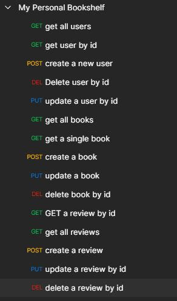

# Fullstack Collaborative Effort - Personal Bookshelf Database


- [link to live site](https://guarded-sierra-08744.herokuapp.com/)

## Description

A web page designed to store book data, user data and reviews data in a SQL database, to be rendered on a browser for the user to interact with. The user will have the ability to look at a catalogue of books on the website, look at reviews for a book, add them to their own "personal bookshelf", as well as update and delete books and reviews.



## Table of Contents

- [Packages Used](#packages)
- [Preview](#preview)
- [Installation](#installation)
- [License](#license)

## Packages

Project put together using the following libraries/packages:

- [bcrypt](https://www.npmjs.com/package/bcrypt)
- [cors](https://www.npmjs.com/package/cors)
- [dotenv](https://www.npmjs.com/package/dotenv)
- [Express.js](https://expressjs.com/)
- [Express-handlebars](https://www.npmjs.com/package/express-handlebars)
- [Express-session](https://www.npmjs.com/package/express-session)
- [handlebars](https://handlebarsjs.com/)
- [mySql2](https://www.npmjs.com/package/mysql2)
- [passport](https://www.npmjs.com/package/mysql2)
- [passport-local](https://www.npmjs.com/package/passport-local)
- [Sequelize](https://sequelize.org/)

## Preview

- 

## Installation

1. Create the database in MySQL workbench using the schema that's found in the db folder

2. Setup the database connection now. Create a .env file and put the following code in it. However replace the contents of DB_USER and DB_PASSWORD to match your MySQL workbench information. (ex. 'root' and 'coolpassword123')

```
DB_NAME='ecommerce_db'
DB_USER='<your_user_here>'
DB_PASSWORD='<your_password_here>'
```

3. Once the database has been made, it's time to seed it with data. Return to your terminal (make sure you are in this projects working directory) and run the command:

```
npm run seed
```

4. After database has been seeded, it's time to run the server running the command:

```
node server.js
```

5. Navigate to POSTMAN, and start testing any endpoints for GET, POST, PUT and DELETE

```
localhost:3001/api/users
localhost:3001/api/users{id}
localhost:3001/api/books
localhost:3001/api/books/{id}
localhost:3001/api/reviews
localhost:3001/api/reviews/{id}
```

## License

[](https://choosealicense.com/licenses/mit/)

For more information about the licensing of this project, please click on the badge above, or follow this link https://choosealicense.com/licenses/mit/
